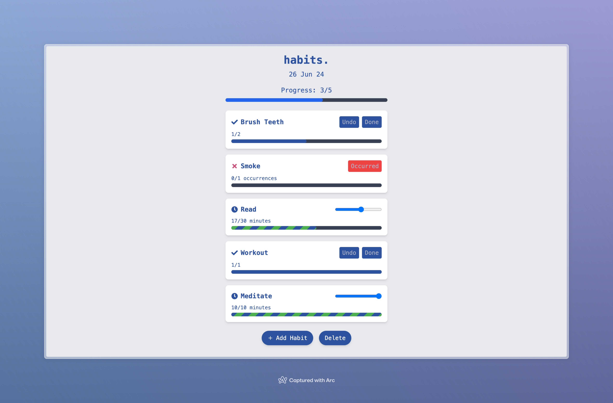

# habits.



A sleek and minimalist habit tracking application built with Next.js and React.

## 🌟 Features

- **Track Multiple Habit Types**: 
  - Regular habits
  - Timed habits
  - Bad habits (for breaking negative patterns)
- **Intuitive UI**: Clean and user-friendly interface for easy habit management
- **Progress Visualization**: Visual progress bars for each habit and overall daily progress
- **Customizable**: Add, edit, and delete habits as needed
- **Daily Reset**: Fresh start every day to keep you motivated
- **Celebration**: Confetti animation when all habits are completed for the day

## 🛠️ Tech Stack

- Next.js
- React
- Tailwind CSS
- Prisma (for database management)
- React Icons

## 🚀 Getting Started

1. Clone the repository
   ```
   git clone https://github.com/yourusername/habits.git
   ```
2. Install dependencies
   ```
   cd habits
   npm install
   ```
3. Set up your environment variables (database connection, etc.)
4. Run the development server
   ```
   npm run dev
   ```
5. Open [http://localhost:3000](http://localhost:3000) in your browser

## 📦 Components

- `AddHabitModal`: For adding new habits
- `HabitStats`: Displays detailed statistics for each habit
- `Confetti`: Celebratory animation for completing all habits

## 🤝 Contributing

Contributions, issues, and feature requests are welcome! Feel free to check [issues page](https://github.com/yourusername/habits/issues).

## 📝 License

This project is [MIT](https://choosealicense.com/licenses/mit/) licensed.

## 🙏 Acknowledgements

- This project was born out of a personal desire to boost productivity during the summer while simultaneously honing my development skills.
- Significant inspiration was drawn from the Streaks app, available on Apple platforms. Their intuitive design and functionality served as a great reference point.
- The color scheme and overall aesthetic are inspired by my favorite Monkeytype theme, Iceberg-light, bringing a touch of familiarity and personal preference to the project.

---

Made with ❤️ and ☕